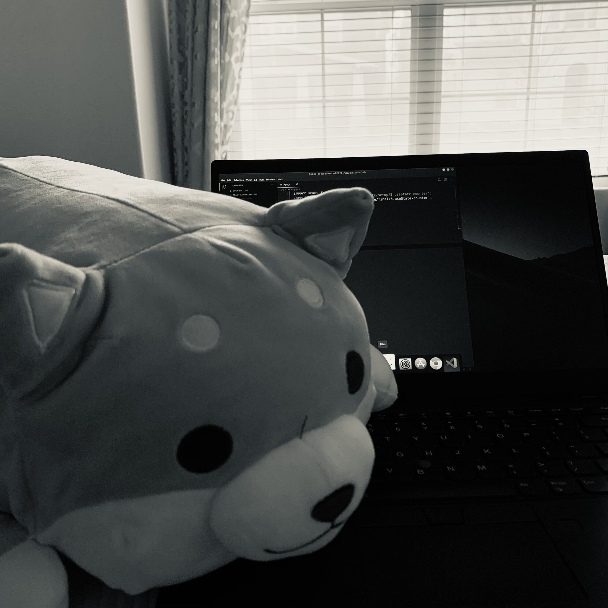

# Anthony Kuang

is just trying his best. Whether it all works out or not, only time will tell :D

I finally have all the time in the world to explore my passions and better myself. Let's set a one-year timer and see where that takes me! :D

## Goals

- [ ] Start a SaaS company
  - [ ] Grow lumiere.codes to 100k users
  - [ ] Lead a complementing and skilled team
- [ ] Be marginally more awesome
  - [ ] Learn in public
  - [ ] Start a YouTube channel
  - [ ] Practical tutorials on building SaaS from the ground up
- [ ] Learn
  - [ ] web3, blockchain, Rust, Startup School, cutting-edge tooling

## List of happy accidents (been there, done that)

- [x] Ghosted by a few dozen people
- [x] Violated a Hack Club TOS
- [x] Burnout upon burnout, imposter syndrome
- [x] Inconsistent sleep schedule

